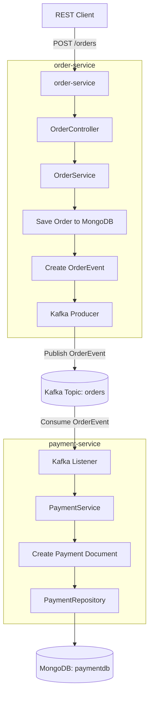

# Microservices Local Development Environment

Local Docker and script-based development environment for the Order Processing microservices demo.

This repository starts the supporting infrastructure and provides helper scripts for running and testing the full local flow:

```text
REST Client
  -> order-service
  -> Kafka topic: orders
  -> payment-service
  -> MongoDB
```

The demo shows a simple event-driven microservices architecture using Spring Boot, Kafka, MongoDB, Docker, and local automation scripts.

---

## Purpose of the Demo

This project demonstrates practical experience with:

* Spring Boot REST APIs.
* Event-driven microservices.
* Kafka producers and consumers.
* MongoDB persistence.
* Docker-based local infrastructure.
* PowerShell automation.
* End-to-end local testing.
* Separation between infrastructure and application services.

The key architectural idea is that services communicate through events instead of direct service-to-service calls. This keeps services loosely coupled and allows new consumers to be added later without changing the existing `order-service` flow.

---

## Quick Start

### Expected workspace layout

Clone the three repositories as sibling folders:

```text
microservicesjava25/
  order-service/
  payment-service/
  local-dev-env/
```

Example:

```powershell
cd D:\Programming\microservicesjava25

git clone https://github.com/IgorArtSoft/order-service.git
git clone https://github.com/IgorArtSoft/payment-service.git
git clone https://github.com/IgorArtSoft/local-dev-env.git

cd local-dev-env
```

### Start everything on Windows

Use this mode when you want to run Kafka and MongoDB in Docker, while running the Java microservices locally from PowerShell.

```powershell
.\scripts\windows\start-all.ps1
```

### Check status

```powershell
.\scripts\windows\status.ps1
```

### Send a test order

```powershell
.\scripts\windows\test-order.ps1
```

### Stop everything

```powershell
.\scripts\windows\stop-all.ps1
```

---

## Local URLs


| Component       | URL                   |
| --------------- | --------------------- |
| order-service   | http://localhost:8081 |
| payment-service | http://localhost:8082 |
| Kafka UI        | http://localhost:8085 |
| MongoDB         | localhost:27017       |
| Kafka           | localhost:9092        |

Kafka UI can be used to inspect Kafka topics, brokers, messages, and consumer groups.

---

## What This Repository Contains

This repository does not contain the Java microservice source code. It contains the local development infrastructure and automation scripts.

| File or folder                  | Purpose                                                                    |
| ------------------------------- | -------------------------------------------------------------------------- |
| `docker-compose.infra.yml`      | Starts Kafka, Kafka UI, and MongoDB                                        |
| `docker-compose.services.yml`   | Starts `order-service` and `payment-service` as Docker-based Java services |
| `scripts/windows/`              | Windows PowerShell scripts for local development                           |
| `scripts/unix/docker-services/` | Unix/Linux shell scripts for Docker-based service execution                |
| `docs/`                         | Additional notes and useful commands                                       |

---

## Related Repositories

The full demo uses three repositories:

| Repository        | Purpose                                                                            |
| ----------------- | ---------------------------------------------------------------------------------- |
| `order-service`   | REST API service that accepts orders, saves order data, and publishes Kafka events |
| `payment-service` | Kafka consumer service that receives order events and creates payment records      |
| `local-dev-env`   | Local Docker infrastructure and helper scripts                                     |

Clone commands:

```powershell
git clone https://github.com/IgorArtSoft/order-service.git
git clone https://github.com/IgorArtSoft/payment-service.git
git clone https://github.com/IgorArtSoft/local-dev-env.git
```

---

## Architecture Overview

The demo contains four main runtime components.

### order-service

`order-service` exposes a REST API for creating and retrieving orders.

Main responsibilities:

* Accept order requests through REST.
* Validate and process order data.
* Save order records into MongoDB.
* Create `OrderEvent` messages.
* Publish order events to Kafka.

### Kafka

Kafka is used as the asynchronous messaging backbone between services.

Main responsibilities:

* Store and deliver order events.
* Decouple `order-service` from `payment-service`.
* Allow additional services to consume the same event in the future.

### payment-service

`payment-service` consumes order events from Kafka.

Main responsibilities:

* Listen to the Kafka `orders` topic.
* Consume `OrderEvent` messages.
* Process payment-related logic.
* Save payment records into MongoDB.

### MongoDB

MongoDB is used as the persistence layer.

Databases used by the demo:

| Database    | Used by           | Purpose                |
| ----------- | ----------------- | ---------------------- |
| `orderdb`   | `order-service`   | Stores order records   |
| `paymentdb` | `payment-service` | Stores payment records |

---

## Data Flow



---

## Business Flow

1. A client sends a `POST /orders` request to `order-service`.
2. `order-service` validates and processes the request.
3. `order-service` saves the order record into MongoDB.
4. `order-service` creates an `OrderEvent`.
5. `order-service` publishes the event to Kafka topic `orders`.
6. `payment-service` consumes the event from Kafka.
7. `payment-service` processes the event.
8. `payment-service` saves the payment record into MongoDB.

This demonstrates asynchronous communication between microservices. `order-service` does not call `payment-service` directly.

---

## Prerequisites

Required software:

| Tool                   | Purpose                            |
| ---------------------- | ---------------------------------- |
| Java JDK 21 or newer   | Build and run Spring Boot services |
| Git                    | Clone repositories                 |
| Docker Desktop         | Run Kafka, Kafka UI, and MongoDB   |
| PowerShell             | Run Windows automation scripts     |
| Maven or Maven Wrapper | Build Java services                |

Verify installation:

```powershell
java -version
git --version
docker --version
docker ps
$PSVersionTable.PSVersion
```

Optional tools:

| Tool                               | Purpose                                   |
| ---------------------------------- | ----------------------------------------- |
| Eclipse, IntelliJ IDEA, or VS Code | Edit and run Java/Spring Boot projects    |
| MongoDB Compass                    | Inspect MongoDB databases and collections |
| Web browser                        | Open Kafka UI and service endpoints       |

---

## Local Ports

Make sure these ports are available before starting the demo.

| Component       |  Port |
| --------------- | ----: |
| order-service   |  8081 |
| payment-service |  8082 |
| Kafka           |  9092 |
| Kafka UI        |  8085 |
| MongoDB         | 27017 |

If one of these ports is already used by another application, the corresponding service may fail to start.

---

## Windows Scripts

The main Windows scripts are located under:

```text
scripts/windows/
```

| Script                       | Purpose                                              |
| ---------------------------- | ---------------------------------------------------- |
| `start-all.ps1`              | Starts infrastructure and microservices              |
| `start-infra.ps1`            | Starts Kafka, Kafka UI, and MongoDB                  |
| `start-services.ps1`         | Starts `order-service` and `payment-service` locally |
| `status.ps1`                 | Shows local runtime status                           |
| `test-order.ps1`             | Sends a sample order request                         |
| `redeploy-order-service.ps1` | Rebuilds and restarts only `order-service`           |
| `stop-all.ps1`               | Stops microservices and infrastructure               |
| `stop-infra.ps1`             | Stops Docker infrastructure                          |

Recommended commands:

```powershell
.\scripts\windows\start-all.ps1
.\scripts\windows\status.ps1
.\scripts\windows\test-order.ps1
.\scripts\windows\stop-all.ps1
```

---

## Docker Compose Files

This repository separates infrastructure and application services into two compose files.

### Infrastructure

```text
docker-compose.infra.yml
```

Starts:

* Kafka
* Kafka UI
* MongoDB

Start only infrastructure:

```powershell
docker compose -f docker-compose.infra.yml up -d
```

Stop only infrastructure:

```powershell
docker compose -f docker-compose.infra.yml down
```

### Docker-based Java services

```text
docker-compose.services.yml
```

Starts:

* `order-service`
* `payment-service`

This mode expects the service JAR files to already exist under the sibling service repositories.

Build the JAR files first:

```powershell
cd ..\order-service
.\mvnw.cmd clean package -DskipTests

cd ..\payment-service
.\mvnw.cmd clean package -DskipTests

cd ..\local-dev-env
```

Start infrastructure and services together:

```powershell
docker compose -f docker-compose.infra.yml -f docker-compose.services.yml up -d
```

Stop infrastructure and services:

```powershell
docker compose -f docker-compose.infra.yml -f docker-compose.services.yml down
```

---

## Example Test Request

You can manually create an order with PowerShell:

```powershell
Invoke-RestMethod `
  -Uri "http://localhost:8081/orders" `
  -Method Post `
  -ContentType "application/json" `
  -Body '{"orderId":"ORD-1001","customerId":"CUST-777","amount":125.50,"currency":"CAD"}'
```

Expected high-level result:

```text
1. order-service receives the order.
2. order-service saves the order into orderdb.
3. order-service publishes an OrderEvent to Kafka.
4. payment-service consumes the event.
5. payment-service saves a payment record into paymentdb.
```

You can verify the flow by checking:

* Kafka UI at `http://localhost:8085`
* MongoDB database `orderdb`
* MongoDB database `paymentdb`

---

## Useful Verification Commands

Check Docker containers:

```powershell
docker ps
```

Check Docker Compose configuration:

```powershell
docker compose -f docker-compose.infra.yml config
docker compose -f docker-compose.infra.yml -f docker-compose.services.yml config
```

Check whether a port is used:

```powershell
Get-NetTCPConnection -LocalPort 8081
Get-NetTCPConnection -LocalPort 8082
Get-NetTCPConnection -LocalPort 8085
Get-NetTCPConnection -LocalPort 9092
Get-NetTCPConnection -LocalPort 27017
```

Check Kafka UI:

```text
http://localhost:8085
```

---

## Troubleshooting

### Docker Desktop is not running

If infrastructure does not start, first confirm Docker Desktop is running:

```powershell
docker ps
```

If this command fails, start Docker Desktop and try again.

### Port is already in use

If a service cannot start, check whether the expected port is already used:

```powershell
Get-NetTCPConnection -LocalPort 8081
```

Then stop the conflicting process or change the port configuration.

### Kafka UI opens but no messages appear

Check that:

* `order-service` is running.
* `payment-service` is running.
* The test order request completed successfully.
* The Kafka topic `orders` exists.
* The consumer group for `payment-service` is active.

### Payment record is not created

Check that:

* `payment-service` is running.
* Kafka is running.
* MongoDB is running.
* The order event was published to Kafka.
* The `payment-service` logs do not show deserialization or connection errors.

---

## Future Repository Rename

This repository is currently named:

```text
local-dev-env
```

Planned future name:

```text
microservices-infrastructure
```

After the repository is renamed, update clone commands, documentation references, and local Git remote URLs accordingly.

Example remote update:

```powershell
git remote set-url origin https://github.com/IgorArtSoft/microservices-infrastructure.git
git remote -v
```
