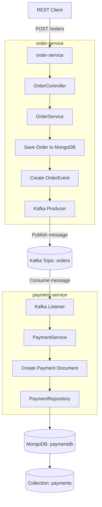

# Microservices Demo: Order Processing with Kafka and MongoDB

For run demo goto folder:<br/>
>cd local-dev-env/scripts<br/>
- mac/linux<br/>
>chmod 775 *.sh<br/>
start.sh<br/>
> stop.sh
-    windows<br/>
> start.ps1

## Overview

This demo project presents a simple event-driven microservices architecture using **Spring Boot**, **RESTful API**, **Kafka**, **MongoDB**, and **Docker**.

The main business flow starts when a client sends a REST request to create an order. The `order-service` receives the request, saves the order data into MongoDB, creates an `OrderEvent`, and publishes the event to a Kafka topic.

The `payment-service` consumes the event from Kafka, processes the payment-related logic, and saves the payment record into MongoDB.

This project demonstrates asynchronous communication between microservices using Kafka.

---

## High-Level Architecture

The system contains four main components:

### 1. order-service

The `order-service` is responsible for accepting order requests.

Main responsibilities:

- Exposes a REST API.
- Accepts new order requests.
- Saves order records into MongoDB.
- Creates `OrderEvent` messages.
- Publishes order events to Kafka.

### 2. Kafka

Kafka acts as the event streaming platform between the services.

Main responsibilities:

- Stores and delivers messages between services.
- Decouples `order-service` from `payment-service`.
- Allows asynchronous communication between microservices.

### 3. payment-service

The `payment-service` is responsible for consuming order events and creating payment records.

Main responsibilities:

- Listens to the Kafka topic.
- Consumes `OrderEvent` messages.
- Processes payment-related logic.
- Saves payment records into MongoDB.

### 4. MongoDB

MongoDB is used as the persistence layer.

Databases used by the demo:

- `orderdb` is used by `order-service`.
- `paymentdb` is used by `payment-service`.

---

## Microservices Repositories

The demo consists of three related GitHub repositories.

### 1. order-service

REST API service responsible for accepting order requests, saving order records into MongoDB, and publishing order events to Kafka.

Repository:	<https://github.com/IgorArtSoft/order-service.git>

### 2. payment-service

Kafka consumer service responsible for listening to order events, processing payment-related logic, and saving payment records into MongoDB.

Repository:	<https://github.com/IgorArtSoft/payment-service.git>

### 3. local-dev-env

Local development environment that contains Docker configuration and helper scripts for running the demo locally.

Repository:	<https://github.com/IgorArtSoft/local-dev-env.git>

---

## Technology Stack

This demo uses the following technologies:

- Java
- Spring Boot
- Spring Web
- REST API
- Spring Kafka
- Apache Kafka
- MongoDB
- Docker
- Maven
- PowerShell scripts for local automation
## Prerequisites

Before running this demo locally, make sure the following software is installed on your machine.

### Required Software

- **Java JDK**

  Required to build and run the Spring Boot microservices.

  Recommended:

  ```text
  Java 21 or newer
  ```

  You can verify Java installation with:

  ```powershell
  java -version
  ```

- **Git**

  Required to clone the project repositories from GitHub.

  Verify installation:

  ```powershell
  git --version
  ```

- **Docker Desktop**

  Required to run the local infrastructure, including Kafka and MongoDB.

  Verify installation:

  ```powershell
  docker --version
  docker ps
  ```

- **PowerShell**

  Required to run the local automation scripts included in the `local-dev-env` repository.

  Verify installation:

  ```powershell
  $PSVersionTable.PSVersion
  ```

- **Maven or Maven Wrapper**

  The services can be built and started using Maven.

  If Maven is installed globally, verify it with:

  ```powershell
  mvn -version
  ```

  If Maven is not installed globally, the included Maven Wrapper can be used instead:

  ```powershell
  .\mvnw.cmd spring-boot:run
  ```

---

### Optional Tools

The following tools are not strictly required, but they are useful during development and testing.

- **Eclipse IDE, IntelliJ IDEA, or Visual Studio Code**

  Useful for editing and running the Java/Spring Boot projects.

- **MongoDB Compass**

  Useful for visually inspecting MongoDB databases and collections.

- **Web Browser**

  Useful for opening Kafka UI and reviewing Kafka topics, messages, brokers, and consumer groups.

---

### Local Ports Used by the Demo

Make sure the following ports are available before starting the local environment.

| Component | Port |
|---|---:|
| `order-service` | `8081` |
| `payment-service` | `8082` |
| Kafka | `9092` |
| Kafka UI | `8085` |
| MongoDB | `27017` |

If any of these ports are already used by another application, the corresponding service may fail to start.
---

## Data Flow



---

## Business Flow Summary

1. A REST client sends a `POST /orders` request to `order-service`.
2. `order-service` receives and processes the order request.
3. `order-service` saves the order record into MongoDB.
4. `order-service` creates an `OrderEvent`.
5. `order-service` publishes the `OrderEvent` to Kafka.
6. `payment-service` consumes the event from Kafka.
7. `payment-service` processes the event.
8. `payment-service` saves the payment record into MongoDB.

---

## Local Development Automation

The `local-dev-env` repository contains helper scripts that simplify running and testing the complete local development environment.

These scripts help automate common development tasks such as:

- Starting Kafka.
- Starting MongoDB.
- Starting both microservices.
- Stopping the full environment.
- Running a test request through the complete flow.

This makes the demo easier to run locally and reduces the need to manually start each component.

---

## Available Automation Scripts

### Start the Complete Local Environment

Use this script to start the full local development environment.

```powershell
.\start-all.ps1
```

This script is intended to start the required infrastructure and services for the demo, including Kafka, MongoDB, `order-service`, and `payment-service`.

---

### Stop the Complete Local Environment

Use this script to stop the full local development environment.

```powershell
.\stop-all.ps1
```

This script shuts down the running services and infrastructure cleanly.

It is designed to avoid unnecessary errors if some services are already stopped.

---

### Start Microservices

Use this script to start the microservices locally.

```powershell
.\scripts\start-services.ps1
```

This script starts the application services used by the demo.

The services are started in separate PowerShell tabs or windows, depending on the local script configuration.

---

### Run a Test Request

Use this script to send a sample test request to `order-service`.

```powershell
.\scripts\test-order.ps1
```

The test request triggers the complete event-driven flow:

1. A sample order request is sent to `order-service`.
2. `order-service` saves the order into MongoDB.
3. `order-service` publishes an event to Kafka.
4. `payment-service` consumes the Kafka event.
5. `payment-service` saves a payment record into MongoDB.

---

## Example Test Request

A typical test request sends a new order to `order-service`.

Example:

```powershell
Invoke-RestMethod `
  -Uri "http://localhost:8081/orders" `
  -Method Post `
  -ContentType "application/json" `
  -Body '{"orderId":"ORD-1001","customerId":"CUST-777","amount":125.50}'
```

Expected result:

```text
Order message sent to Kafka.
```

After the request is processed, the order should be saved in `orderdb`, and the payment record should be created in `paymentdb`.

---

## Local URLs

When the local environment is running, the following URLs can be used.

### order-service

```text
http://localhost:8081
```

### payment-service

```text
http://localhost:8082
```

### Kafka UI

```text
http://localhost:8085
```

Kafka UI can be used to inspect Kafka topics, messages, brokers, and consumer groups.

---

## MongoDB Databases

The demo uses two MongoDB databases.

### orderdb

Used by `order-service`.

Stores order-related records.

### paymentdb

Used by `payment-service`.

Stores payment-related records created after consuming Kafka events.

---

## Purpose of the Demo

This project was created to demonstrate practical hands-on experience with modern microservices development.

It highlights the following skills:

- Building REST APIs with Spring Boot.
- Designing simple microservices.
- Using Kafka for asynchronous communication.
- Creating Kafka producers and consumers.
- Persisting data with MongoDB.
- Running infrastructure locally with Docker.
- Automating local development tasks with PowerShell scripts.
- Testing an end-to-end event-driven flow.

---

## What This Demo Shows

This project demonstrates how independent services can communicate without calling each other directly.

Instead of `order-service` directly invoking `payment-service`, the services communicate through Kafka events.

This approach improves separation of responsibilities and makes the system easier to extend. For example, additional services could later consume the same order event without changing the existing `order-service` logic.

---

## How to Run the Demo Locally

### 1. Clone the repositories

```powershell
git clone https://github.com/IgorArtSoft/order-service.git
git clone https://github.com/IgorArtSoft/payment-service.git
git clone https://github.com/IgorArtSoft/local-dev-env.git
```

### 2. Start the local environment

Go to the `local-dev-env` folder and run:

```powershell
.\start-all.ps1
```

### 3. Run a test request

```powershell
.\scripts\test-order.ps1
```

### 4. Verify the result

You can verify the result by checking:

- Kafka topic messages in Kafka UI.
- Order records in MongoDB `orderdb`.
- Payment records in MongoDB `paymentdb`.

### 5. Stop the environment

```powershell
.\stop-all.ps1
```

---

## Summary

This demo shows a complete local microservices workflow using Spring Boot, Kafka, MongoDB, Docker, and PowerShell automation.

It demonstrates how an order request can be processed asynchronously by multiple services using Kafka as the messaging backbone.